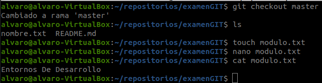

# <b>Examen GIT</b>
## <b>Ejercicio 1 (Repositorios Locales)</b>
En este ejercicio he creado una serie de repositorios, archivos y ramas usando varios comandos, después los he fusionado.
Creado README y nombre.txt, he añadido mi nombre y he realizado el primer commit.

He creado la rama apellidos y en ella modificado el archivo nombre.txt y creado el archivo curso.txt, después un commit para guardar sus cambios.

Cambio a la rama Master y creado Modulo.txt.

Unidas las ramas master y apellidos y luego eliminada la rama apellidos.

## <b>Ejercicio 2 (Repositorios Remotos)</b>
El ejercicio 2 se basa en crear un repositorio remoto y subir el contenido del ejercicio 1 ademas de hacer varias modificaciones.
Para hacer esto creamos el repositorio en Github y usamos el enlace proporcionado para poder unirnos al remoto.

Aqui añadimos el remoto para poder hacer push a los archivos modificados.

Historial de los commits realizados.

Por alguna razón el token ha decidido borrarse solo a pesar de haberse modificado para no caducar y ademas haberlo usado perfectamente para los primeros push. Debido a esto he perdido 3 capturas y he tenido que realizar el resto de subidas usando VSCode, pero aqui dejo el historial de comandos usados hasta ese momento.

Unidas la rama_nueva y master y luego eliminada la rama_nueva.

Este es el historial de Commits Realizados en VSCode.
